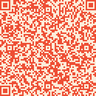

# qrtool

## Overview

A command line tool that generates QR codes and outputs them as a PNG file. You can supply command line arguments to set the input text, ECC level, mask, and min/max version of the QR code. There are also command line argument that are used to set the outputted image scale and foreground/background color. A helpful command line argument, --verify, is used to visualize what the QR code will look like before saving the image to disk. Also, --quiet, that will supress and text outputted to the terminal, except if any error occurs. You can set the QR code text via stdin or a command line argument. Provide an output file via a command line argument to save the image somewhere on disk.





## Quick Start
```bash
# Building
mkdir build
cd build
cmake .. # It may take a little bit!
make -j 8

# Installing
sudo make install
```

## Examples
```bash
# Input text via command line argument
./build/qrtool                                                 \
--text-input             "https://github.com/REDl3east/qrtool" \
--error-correction-level "high"                                \
--mask                    5                                    \
--version-min-range       10                                   \
--version-max-range       20                                   \
--foreground-color        "#153801ff"                          \
--background-color        "#e5fad9ff"                          \
--scale                   3                                    \
--output                  "./assets/example1.png" 

# Input text via stdin, also add transparency to background, and boost ECC if needed.
# If text is inputted via the keyboard then press Ctrl+D to continue.
printf "%s" "What are you looking at?" | ./build/qrtool        \
--error-correction-level "low"                                 \
--mask                    7                                    \
--version-min-range       1                                    \
--version-max-range       10                                   \
--foreground-color        "#2f3c7e77"                          \
--background-color        "#fbeaeb77"                          \
--scale                   5                                    \
--boost-ecc                                                    \
--output                  "./assets/example2.png" 

# Input text via command line argument and verify the QR code before saving.
# Also supress any outputted text to terminal.
./build/qrtool                                                 \
--text-input             "This is some really long text. There once was a guy named Jim who lived in the middle of Nowhere. He lived with a nice pink dog named Aaudacious. :)" \
--error-correction-level "high"                                \
--mask                    3                                    \
--version-min-range       10                                   \
--version-max-range       20                                   \
--foreground-color        "#ee4e34ff"                          \
--background-color        "#fceddaff"                          \
--scale                   3                                    \
--output                  "./assets/example3.png"              \
--verify                                                       \
--quiet
```                                         


## command line options:  

##### -t, --text-input=INPUT
The input text that will be used to generate the QR code   
##### -z, --error-correction-level=LEVEL
The Error Correction Level of the QR Code. [LOW | MEDIUM | QUARTILE | HIGH | L | M | Q | H] (Default is high)   
##### -m, --mask=MASK
The mask used to generate the QR code. [0 | 1 | 2 | 3 | 4 | 5 | 6 | 7] (If this option is absent, then the mask is automatically selected)   
##### -a, --boost-ecc
If present, this option will increase the error correction level if needed.   
##### -x, --version-max-range=NUM
The max version of the QR code. (1-40 and if absent, default to 40)   
##### -n, --version-min-range=NUM
The min version of the QR code. (1-40 and if absent, default to 1)   
##### -f, --foreground-color=COLOR
The foreground color of the QR code. Use hex notation: #RRGGBBAA (Default is black)   
##### -b, --background-color=COLOR
The background color of the QR code. Use hex notation: #RRGGBBAA (Default is white   
##### -s, --scale=FLOAT
The scale of the outputted qr code. (Default is 1.0)   
##### -o, --output=FILE
The outputted image of the QR code.   
##### -v, --verify
Show the image before saving the image. Press 'y' to save image and 'n' to cancel saving.   
##### -q, --quiet
Only output text if there is an error. --help and --version will still output text.   
##### --help
print this help and exit   
##### --version
print version information and exit   

## Dependancies
- cmake 3.0.0+
- [SDL2](https://github.com/libsdl-org/SDL.git)
- [SDL_image](https://github.com/libsdl-org/SDL_image.git)
- [QR-Code-generator](https://github.com/nayuki/QR-Code-generator.git)
- [argtable3](https://github.com/argtable/argtable3.git)

Cmake will take care of all dependancies, so you really only need the correct cmake version to build and install.

<!-- 
Thoughts:
* Have a batch option for multiple text input. 
-->